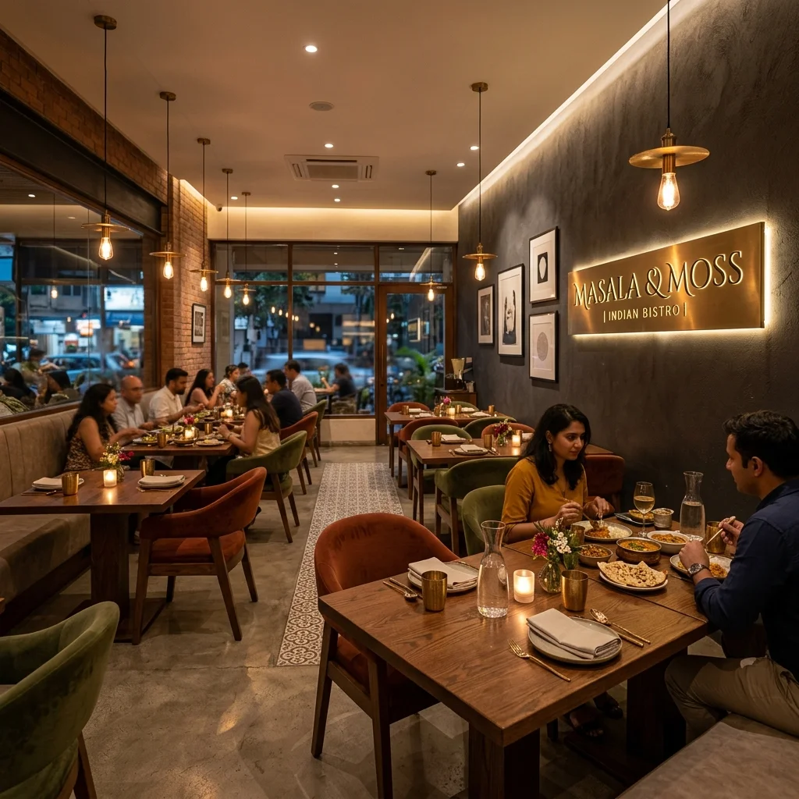
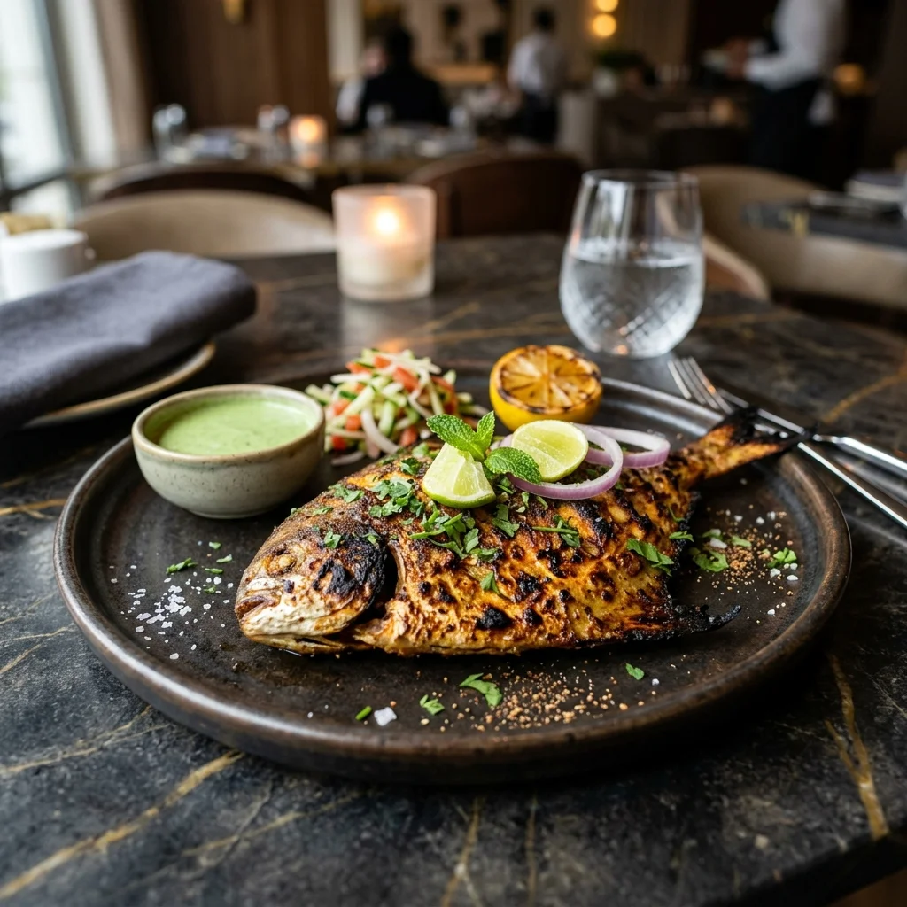

# Spice Haven — Complete Technical Rebuild Guide

> **Scope:** Build a functionally identical, legally distinct clone of
> https://themewagon.github.io/spicehaven/ — a multi-page static restaurant
> website for a fictional Indian restaurant.

---

## 1. Site Overview

| Property     | Value                                           |
|--------------|-------------------------------------------------|
| Type         | 4-page static restaurant site                   |
| Pages        | `index.html`, `menu.html`, `about.html`, `book-a-table.html` |
| Shared code  | Identical `<nav>` + `<footer>` across all pages |
| Media        | 18 `.webp` images, 1 `.jpg`, 2 `.mp4` videos   |
| JS behaviours| Hamburger menu, dynamic hero margin, scroll shadow, active link highlight |
| Third-party  | None — fully dependency-free                    |
| Accessibility| `aria-label` on hamburger, `playsinline` on video, semantic HTML |

The site belongs to ThemeWagon (an HTML template marketplace). The design is
generic enough that a new brand name, new colour palette, new copy, and fully
re-sourced media will produce a legally distinct product.

---

## 2. Recommended Tech Stack

### Primary recommendation — Vanilla HTML / CSS / JavaScript

```
HTML5   — semantic elements, no template engine
CSS3    — custom properties, CSS Grid, Flexbox, clamp(), viewport units
JS ES6  — vanilla, no framework
```

**Why vanilla?** The site is content-heavy, not application-heavy. Vanilla
eliminates framework overhead, requires zero build step, and loads in under
100 ms on mobile. A framework (React, Next.js, Nuxt) is over-engineering
unless you need a CMS, SSR, or authentication.

### Alternative — Astro 5 + Tailwind CSS

```
Astro 5.x  +  Tailwind CSS  +  optional React islands (booking form)
```

Astro ships near-zero JS by default. It supports MDX for the menu card grid
and lets you opt-in interactivity via React islands only where needed.
Use Tailwind utility classes plus a minimal `globals.css` for design tokens.

### What NOT to use

| Technology       | Why to skip                                        |
|------------------|----------------------------------------------------|
| WordPress        | Overkill; requires hosting + maintenance            |
| React SPA        | Navigation would require client-side routing        |
| Bootstrap / Tailwind full-set | Large unused weight; makes custom override harder |

---

## 3. Design Tokens

Extracted directly from the stylesheet (`css/style.css`):

```css
:root {
  --bg:           #eeecec;      /* page background */
  --accent:       #999c68;      /* green used in badges, accents, and brand bar */
  --accent-dark:  #6a6a3a;      /* dark green — buttons and hover states */
  --black:        #000000;
  --gray:         #6a6a6a;      /* secondary text colour */
  --footer-bg:    #888888;
  --white:        #ffffff;

  --font-display: 'Georgia', 'Times New Roman', serif;   /* headlines */
  --font-body:    'Trebuchet MS', 'Lucida Sans', sans-serif; /* body text */
}
```

Branding starts by changing these six tokens. Everything else follows.

Suggested replacements for a new brand:
```css
:root {
  --bg:           #f9f6f0;         /* warm cream */
  --accent:       #b45309;         /* amber (new brand) */
  --accent-dark:  #7c2d12;         /* deep burnt orange */
  --black:        #1a1a1a;
  --gray:         #5c5c5c;
  --footer-bg:    #3d3d3d;
  --white:        #ffffff;
  --font-display: 'Playfair Display', Georgia, serif;
  --font-body:    'Inter', 'Helvetica Neue', sans-serif;
}
```

---

## 4. Project File Structure

```
spicehaven/
├── index.html            ← Homepage (hero + intro + image duo + gallery grid)
├── menu.html             ← Menu page (video hero + category card grid)
├── about.html            ← About story + contact + hours + embedded map
├── book-a-table.html     ← Reservation form + date/time selector + confirmation popup
├── css/
│   └── style.css         ← Single global stylesheet (~660 lines), shared by all pages
├── js/
│   └── main.js           ← 65 lines: nav toggle, hero margin, scroll shadow, active link
├── images/               ← 18 WebP images + 1 JPEG sourced from Unsplash / Pixabay
│   ├── hero.webp
│   ├── about-1.webp
│   ├── about-2.webp
│   ├── gallery-1.webp … gallery-16.jpg
└── videos/               ← Short, compressed MP4s sourced from Pexels or filmed in-house
    ├── video-1.mp4        ← Gallery autoplay clip
    └── menu.mp4           ← Menu page hero background
```

All four HTML pages import the same `css/style.css` and `js/main.js`. Copying
the nav and footer markup verbatim is the standard pattern — keep it identical.

---

## 5. Component-by-Component Breakdown

### 5.1 Navbar (`<nav class="topnav">`)

**HTML:**
```html
<nav class="topnav" id="myTopnav">
  <div class="nav-top-row">
    <div class="logo">YOUR BRAND NAME</div>
    <button class="nav-hamburger" id="navHamburger" aria-label="Toggle menu">&#9776;</button>
  </div>
  <div class="nav-links" id="navLinks">
    <a href="index.html" class="active">HOME</a>
    <a href="menu.html">MENU</a>
    <a href="about.html">ABOUT</a>
    <a href="about.html#contact">CONTACT</a>
    <a href="book-a-table.html">BOOK A TABLE</a>
  </div>
</nav>
```

**CSS key rules:**
| Concern      | Rule |
|--------------|------|
| Position     | `position: fixed; top: 0; left: 0; width: 100%; z-index: 1000` |
| Row 1 layout | `justify-content: center; position: relative` (hamburger is `position: absolute; right: 20px`) |
| Row 2 layout | `display: flex; gap: clamp(14px, 3vw, 44px); border-top: 1px solid rgba(0,0,0,.09)` |
| Logo font    | `font-family: var(--font-display); font-size: clamp(22px, 3.5vw, 42px); font-weight: 900; letter-spacing: 4px` |
| Link font    | `font-size: clamp(10px, 1.1vw, 12px); font-weight: 700; letter-spacing: 2px` |
| Active link  | `color: var(--accent-dark); border-bottom: 2px solid var(--accent-dark)` |
| Mobile       | `@media (max-width: 768px)` → `.nav-links { display: none; flex-direction: column; }`; `.topnav.open .nav-links { display: flex; }` → visible |

---

### 5.2 Hero Section (`<section class="hero" id="heroSection">`)

The hero is the landing page's visual anchor. It uses a full-bleed background
image with a gradient overlay so white text remains readable.

**HTML:**
```html
<section class="hero" id="heroSection">
  <div class="hero-inner">
    <span class="hero-badge">&#10022; Est. 2010 &#183; San Francisco</span>
    <h1 class="hero-title">
      Where Every<br>Spice Tells<br>a <em>Story</em>
    </h1>
    <div class="hero-ctas">
      <a href="menu.html" class="btn-primary">VIEW OUR MENU</a>
      <a href="book-a-table.html" class="btn-ghost">BOOK A TABLE</a>
    </div>
  </div>
  <div class="hero-scroll-hint">
    <span>SCROLL</span>
    <div class="scroll-line"></div>
  </div>
</section>
```

**CSS key rules:**
| Concern       | Rule |
|---------------|------|
| Height        | `min-height: clamp(480px, 78vh, 780px)` |
| BG image      | `background: linear-gradient(to bottom, rgba(0,0,0,.6), rgba(0,0,0,0)), url('../images/hero.webp') center/cover no-repeat` |
| Text overlay  | `::before` pseudo-element: `position: absolute; inset: 0; background: linear-gradient(to top, rgba(0,0,0,.80) 0%, rgba(0,0,0,.35) 48%, rgba(0,0,0,.06) 100%); pointer-events: none` |
| Text block    | `position: relative; z-index: 1; max-width: 680px; right: 36px; text-align: right` |
| Headline      | `font-family: var(--font-display); font-size: clamp(46px, 9vw, 100px); font-weight: 900` |
| Accent text   | `.hero-title em { font-style: italic; color: var(--accent) }` |
| Badge         | `border: 1.5px solid var(--accent); color: var(--accent); padding: 5px 14px; letter-spacing: 3px; font-size: 10px` |
| CTA primary   | `background: var(--accent-dark); color: white; padding: 16px 34px; letter-spacing: 2.5px; font-size: 11px; font-weight: 700` |
| CTA ghost     | `background: transparent; border: 1.5px solid rgba(255,255,255,.55); padding: 15px 32px` |
| Scroll hint   | `position: absolute; bottom: 28px; left: 36px; writing-mode: vertical-rl; letter-spacing: 3px; font-size: 9px; color: rgba(255,255,255,.5)` |
| Margin (fix)  | Set via JS — `hero.style.marginTop = nav.offsetHeight + 'px'` — prevents nav from covering content |

---

### 5.3 Menu Intro Section (`<section class="about">`)

```html
<section class="about">
  <div class="big-text">OUR MENU</div>
  <div class="small-text">
    <p>…descriptive paragraph…</p>
    <a href="menu.html"><b>EXPLORE MENU</b></a>
  </div>
</section>
```

- `display: flex; gap: 24px; flex-wrap: wrap; padding: clamp(28px, 4vw, 56px)`
- `.big-text`: `font-family: Georgia; clamp(40px, 8vw, 96px); flex: 1`
- `.small-text`: `flex: 1; line-height: 1.75; min-width: 220px`
- Link style: `border-bottom: 2px solid var(--black); letter-spacing: 2px; text-transform: uppercase`

---

### 5.4 Image Duo (`<div class="image-box">`)

```html
<div class="image-box">
  <div class="img1"></div>
  <div class="img2"></div>
</div>
```

- `display: flex; gap: 6px;`
- Each ``: `width: 100%; height: clamp(200px, 35vw, 500px); object-fit: cover`
- Hover: `transform: scale(1.03); transition: transform .4s ease`
- Mobile: `@media (max-width: 768px)` → `flex-direction: column; height: 230px`

---

### 5.5 Green Banner / Brand Statement (`<section class="box-section">`)

```html
<section class="box-section">
  <div class="box1">IT'S ALWAYS<br>MORE THAN<br>GOOD FOOD</div>
  <div class="box2">
    <p>…brand statement paragraph…</p>
    <a href="about.html">ABOUT US</a>
  </div>
</section>
```

- Background: `var(--accent)` (the brand green — replace with your accent)
- `.box1`: `font-family: Georgia; clamp(28px, 6vw, 80px); font-weight: 900`
- `.box2`: `flex: 1; min-width: 220px; line-height: 1.85`; link uses `border-bottom: 2px solid var(--black)`

---

### 5.6 Testimonial Strip (`<div class="testimonial-strip">`)

```html
<div class="testimonial-strip">
  <p class="testimonial-quote">"…customer quote…"</p>
  <p class="testimonial-author">— CUSTOMER NAME &#9733;&#9733;&#9733;&#9733;&#9733; &#160; GOOGLE REVIEW</p>
</div>
```

- Background `#000000`; padding `clamp(36px, 5vw, 68px) clamp(24px, 7vw, 120px)`
- `.testimonial-quote`: `font-family: Georgia; font-style: italic; font-size: clamp(18px, 3vw, 32px); color: rgba(255,255,255,.92); max-width: 820px; margin: 0 auto`
- `.testimonial-author`: `color: var(--accent); letter-spacing: 2.5px; text-transform: uppercase; font-size: 11px`

---

### 5.7 Moments Heading (`<div class="tag">`)

```html
<div class="tag">
  <p>YOUR BRAND MOMENTS</p>
  <a href="https://instagram.com/yourhandle" target="_blank" rel="noopener noreferrer">FOLLOW US ON INSTAGRAM</a>
</div>
```

- `display: flex; justify-content: space-between; flex-wrap: wrap; padding: clamp(18px, 3vw, 36px) clamp(20px, 5vw, 60px)`
- `<p>`: `font-family: Georgia; clamp(22px, 5.5vw, 72px); font-weight: 900`
- Link: `border-bottom: 2px solid var(--black); letter-spacing: 2px; text-transform: uppercase; hover → opacity 0.6`

---

### 5.8 Photo Gallery Grid (`<div class="grid-container">`)

```html
<div class="grid-container">
  <div class="item1">……</div>
  …
  <div class="item8">…<video src="videos/video-1.mp4" autoplay muted loop playsinline>…</div>
  …
  <div class="item16">……</div>
</div>
```

| Concern      | Rule |
|--------------|------|
| Container    | `display: grid; grid-template-columns: repeat(5, 1fr); gap: 6px; background: #000; padding: 6px` |
| Cell height  | `220px; object-fit: cover; transition: transform .35s ease, opacity .35s ease` |
| Hover zoom   | `img { transform: scale(1.06); opacity: .75 }` on `.grid-container > div:hover img` |
| Price pill   | `position: absolute; bottom: 0; left: 0; right: 0; background: rgba(0,0,0,.62); color: white; transform: translateY(100%)` → `translateY(0)` on parent hover |
| Video cell   | `autoplay muted loop playsinline` attributes required; no `src` with a capital letter mismatch: the original uses `video-1.mp4` |
| Video span   | `.item8 { grid-column: span 2; grid-row: span 2; }` — `min-height: 446px` |
| `item16`     | `.item16 { grid-column: span 2; }` |
| 5-col default | `repeat(5, 1fr)` — tops out at large desktop widths |
| Tablet       | `@media (max-width: 900px)` → `grid-template-columns: repeat(3, 1fr)` |
| Phone        | `@media (max-width: 560px)` → `grid-template-columns: repeat(2, 1fr); img { height: 160px }` |
| Responsive span collapse | `.item8` `min-height` changes to `220px` at 900 px and `160px` at 560 px |

**Why ` playsinline`?** Prevents iOS Safari from forcing the video into fullscreen
on autoplay — a mandatory attribute for inline autoplay on iOS.

---

### 5.9 Footer (`<footer class="footer">`)

```html
<footer class="footer">
  <div class="footer-logo">
    <svg viewBox="0 0 180 97" xmlns="http://www.w3.org/2000/svg">
      <!-- five overlapping rectangles + one diamond forming an abstract mark -->
      <path fill="#000" d="M92 75c0-12.15 9.85-22 22-22h22v22…"/>
      …
    </svg>
  </div>
  <div class="footer-box">
    <div class="footer-box1">
      <p>INDIAN RESTAURANT<br>&amp; CAFFE</p>
      <b>YOUR BRAND NAME</b>
    </div>
    <div class="footer-box2">
      123 Main Street<br>San Francisco CA 94158<br>T: 123-456-7890<br>
      E: hello@yourbrand.com<br><br>Mon–Sun: 12:00 PM – 10:30 PM
    </div>
    <div class="footer-box3">
      <a href="index.html">HOME</a>
      <a href="menu.html">MENU</a>
      <a href="about.html">ABOUT</a>
      <a href="about.html#contact">CONTACT</a>
      <a href="book-a-table.html">BOOK A TABLE</a>
      <a href="https://instagram.com/yourhandle" target="_blank" rel="noopener noreferrer">INSTAGRAM</a>
      <a href="https://facebook.com/yourpage" target="_blank" rel="noopener noreferrer">FACEBOOK</a>
    </div>
  </div>
  <p>&copy; 2026 Your Brand. All rights reserved.</p>
</footer>
```

- Footer bg: `#888888`
- `.footer-box`: `display: flex; gap: 24px; flex-wrap: wrap`
- `.footer-box1` (`flex: 2`): brand label + giant `<b>` name with `Georgia` at `clamp(32px, 5vw, 62px)`
- `.footer-box2` (`flex: 1`): address, phone, email, hours — small body font
- `.footer-box3` (`flex: 1`): column of vertical links; `align-items: flex-end`; hover → `color: white`
- Mobile: `@media (max-width: 480px)` → `flex-direction: column; align-items: flex-start`

---

### 5.10 Booking Form (`book-a-table.html`)

```html
<form id="bookingForm">
  <select id="guests"><option>1 Guest</option><option>2 Guests</option>…<option>10 Guests</option></select>
  <input type="date" id="book-date">
  <input type="time" id="book-time">   <!-- in JS this is hidden; slot selection drives submission -->

  <p class="time-slot-label">Choose an available time slot:</p>
  <div class="time-grid">
    <div class="time-slot">12:00 PM</div><div class="time-slot">12:30 PM</div>
    …<div class="time-slot">9:30 PM</div>
  </div>

  <button type="submit" class="book-btn">BOOK NOW</button>
</form>

<!-- Confirmation popup -->
<div class="form-popup" id="confirmPopup">
  <div class="form-container">
    <h1>Thank you!</h1>
    <p>Your table reservation is submitted. We will confirm shortly.</p>
    <button class="btn cancel" id="closePopup">CLOSE</button>
  </div>
</div>
```

| Concern         | Rule |
|-----------------|------|
| Controls bar    | `display: flex; justify-content: center; gap: clamp(16px, 4vw, 52px); flex-wrap: wrap; padding: clamp(16px, 3vw, 36px) clamp(16px, 5vw, 64px)` |
| Field           | `flex-direction: column; label: font-size 11px; letter-spacing 2px; text-transform: uppercase; input/select: border-bottom: 2px solid black; background: transparent; appearance: none; width: 100%` |
| Time-slot grid  | `display: grid; grid-template-columns: repeat(auto-fill, minmax(130px, 1fr)); gap: 8px` |
| `.time-slot`    | `border: 1.5px solid black; padding: 13px 8px; cursor: pointer; text-align: center; font-size: 14px; font-weight: 600` |
| `.time-slot.selected` | `background: var(--accent-dark); color: white; border-color: var(--accent-dark)` |
| Book button     | `display: block; background: var(--accent-dark); color: white; width: clamp(200px, 80%, 320px); margin: 0 auto 44px; font-size: 16px; font-weight: 700; letter-spacing: 2px` |
| Popup           | `position: fixed; inset: 0; background: rgba(0,0,0,.52); z-index: 2000; display: none → flex; align-items: center; justify-content: center` — `.active` class to show |
| JS              | On form submit: prevent default; validate guests + date + selected slot; show popup. On `closePopup` click: `popup.classList.remove('active')`. |

---

### 5.11 About Page (`about.html`)

Two main sections pasted from the original:

```
.about-box        ← flex column with logo SVG + text paragraph
.contact-box      ← flex row: heading "CONTACT" | address | opening hours + book CTA
```

- `.about-box`: `display: flex; gap: 36px; padding: clamp(36px, 5vw, 80px)`
  - Left col (`flex: 1`): `<h1>` heading with embedded SVG mark
  - Right col (`flex: 1.5`): paragraphs `line-height: 1.85; margin-bottom: 18px`
- `.contact-box`: same flex layout
  - Left: `.text-box` — `font-family: Georgia; clamp(36px, 7vw, 76px); font-weight: 900`
  - Right: `.text-content` and `.text-content2` — `line-height: 2;` for crisp emailed/telephoned contact links

---

## 6. JavaScript (`js/main.js`)

Paste this verbatim at the end of every HTML page's `<body>`:

```js
document.addEventListener('DOMContentLoaded', function () {
  var nav       = document.getElementById('myTopnav');
  var hamburger = document.getElementById('navHamburger');
  var hero      = document.getElementById('heroSection');

  // ── 1. Set hero margin to avoid fixed-nav overlap ──
  function setHeroMargin() {
    if (nav && hero) hero.style.marginTop = nav.offsetHeight + 'px';
  }
  setHeroMargin();
  window.addEventListener('resize', function () { setHeroMargin(); });

  // ── 2. Mobile hamburger toggle ──
  if (hamburger && nav) {
    hamburger.addEventListener('click', function () {
      nav.classList.toggle('open');
      setTimeout(setHeroMargin, 10);
    });
  }

  // ── 3. Close nav when a link is tapped (mobile) ──
  if (nav) {
    nav.querySelectorAll('.nav-links a').forEach(function (link) {
      link.addEventListener('click', function () {
        nav.classList.remove('open');
        setTimeout(setHeroMargin, 10);
      });
    });
  }

  // ── 4. Deepen nav shadow on page scroll ──
  window.addEventListener('scroll', function () {
    if (!nav) return;
    nav.style.boxShadow = window.scrollY > 10
      ? '0 2px 14px rgba(0,0,0,0.14)'
      : '0 1px 4px rgba(0,0,0,0.08)';
  });

  // ── 5. Highlight active navigation link ──
  var page = window.location.pathname.split('/').pop() || 'index.html';
  if (nav) {
    nav.querySelectorAll('.nav-links a').forEach(function (a) {
      var href = a.getAttribute('href');
      if (href && href !== '#' && page === href) a.classList.add('active');
    });
  }
});
```

No other behaviour (no sliders, no form validation library) exists in the
original — everything is handled in CSS transitions and vanilla DOM events.

---

## 7. Royalty-Free Asset Sourcing

Use these platforms to legally source every image and video. All listed
platforms offer CC0 or commercial-license content — no rights fees required.

### 7.1 Images

| Platform       | Best for                   | License        | Attribution  |
|----------------|----------------------------|----------------|--------------|
| **Unsplash**   | Food, interiors, portraits | Unsplash       | Optional     |
| **Pexels**     | Restaurant/food, lifestyle | Creative Commons Zero | No |
| **Pixabay**    | Diverse categories         | Pixabay Content | No          |
| **Pexels / Unsplash API** | Programmatic download (optional — save URLs to a JSON, fetch at build time) | — | — |

**Search strategy — find visually distinct, high-quality replacement images:**

| Original asset                    | Replace with queries on Unsplash/Pexels/Pixabay |
|-----------------------------------|--------------------------------------------------|
| `hero.webp` — restaurant scene    | "Indian restaurant interior", "cozy restaurant dining" |
| `about-1.webp` — interior         | "restaurant dining room warm light", "wooden restaurant interior" |
| `about-2.webp` — food dish        | "Indian food platter", "curry dish overhead" |
| `gallery-1.webp` – `gallery-14.webp` | "street food India", "biryani bowl", "naan bread", "masala chai", "tandoor", "restaurant dish overhead", "spice bowl" — mix of starters, mains, and ambience shots |
| `gallery-16.jpg`                  | "dessert restaurant" (last item is JPEG — convert to WebP) |
| `menu.mp4` / `video-1.mp4`        | "restaurant kitchen cooking timelapse", "food steam close-up" |

> **Camera depot curation:** Use at minimum **two different composition techniques**
> — overhead flat-lay AND 45-degree angle OVER THE RESTAURANT sequence so gallery
> shows variety rather than uniform imagery. Pick Warm Light/Cool Light pairing
> which could be good composition pale pieces.

---

### 7.2 Videos

| Platform       | Format | Best for              |
|----------------|--------|-----------------------|
| **Pexels Videos**  | MP4    | Free stock short clips, food prep, restaurant ambience |
| **Coverr**         | MP4    | Loopable hero backgrounds |
| **Mixkit**         | MP4    | Free cinematic short clips (food, lifestyles) |
| **Videvo**         | MP4    | Free + paid stock footage |

**Video requirements for this site:**
- Menu hero (`menu.mp4`): 15–30 s loop, vertical/desktop square, muted autoplay
- Gallery clip (`video-1.mp4`): 5–15 s, cropped to grid `min-height: 220px`, muted autoplay loop
- Always compress to **< 2 MB** with `ffmpeg` before committing, and **convert to WebM** as a WebP fallback:
  ```
  ffmpeg -i source.mp4 -c:v libvpx-vp9 -crf 30 -b:v 0 -c:a libopus source.webm
  ```
  Add `<source src="…webm" type="video/webm">` under each `<video>` tag.

### 7.3 Icons & Branding

| Asset   | Platform              | Spec                                               |
|---------|-----------------------|----------------------------------------------------|
| Favicon / SVG logo mark | Draw yourself → hero-or SVG into a 180×97 `<svg>` inline fav | No external dependency |
| Social icons (IG, FB) | `simpleicons.org` | SVGs free, no attrib req; or use `<a>` text labels like the original |
| Google Maps embed | Google Maps Embed API | Free tier; paste `<iframe>` inside About contact section |

---

## 8. Step-by-Step Build Roadmap

Follow this order to avoid rework:

### Step 1 — Scaffold project
```
mkdir spicehaven
cd spicehaven
mkdir css js images videos
```

### Step 2 — Define design tokens in `css/style.css`
Write the `:root` custom properties first. Change all 6 tokens to your brand
colours and fonts. Run the site locally now to verify nothing is hard-coded
in specific hex values — replace any `#999c68` etc. in existing component
rules.

### Step 3 — Build navbar + footer in `index.html`
These two components appear on every page. Get them pixel-perfect first.
Navbar must be `position: fixed` with a working hamburger. Footer must stack
correctly at width 375 px.

### Step 4 — Build the hero in `index.html`
Apply `hero.webp` as background image. Verify the dark overlay makes white
text readable. Hook JS `setHeroMargin()` to prevent nav overlap.

### Step 5 — Build remaining home blocks in order
`about` → `image-box` → `box-section` → `testimonial-strip` → `tag` →
`grid-container`. The grid is the hardest CSS — build it last.

### Step 6 — Source and compress all media
Pull new images from Unsplash / Pexels. Compress with [Squoosh](https://squoosh.app)
or `sharp` (CLI). Target `< 150 KB` per image, `< 2 MB` per video.

### Step 7 — Build `menu.html`
Copy `index.html` nav/footer. Add the `.menu-hero` video background and the
`.menu-category` card grid. Populate `menu-grid` with your own dish copy +
prices.

### Step 8 — Build `about.html`
Copy nav/footer. Add `.about-box` (story / About section) and `.contact-box`
(contact details + embedded map iframe).

### Step 9 — Build `book-a-table.html`
Copy nav/footer. Add the booking form: select + date + time-slot grid +
submit button + confirmation popup.

### Step 10 — Test across breakpoints
Open in Chrome DevTools at widths: 375 px · 768 px · 1024 px · 1440 px.
Resize the window and observe all three CSS breakpoints for every component.
Fix inline (avoid full-width menus or squashed grid items).

### Step 11 — Performance audit
```
- Lighthouse → Performance target > 85
- All images must carry width/height or use Modern Image Format (WebP)
- Use rel="preconnect" for any external font
```

### Step 12 — Legal distinctness check
Before publishing, run this checklist:

| Item                                              | Status  |
|---------------------------------------------------|---------|
| Brand name replaced from "Spice Haven"            | ☐       |
| All 6 design tokens changed                       | ☐       |
| New copy in headline, body text, footer, nav       | ☐       |
| All 18 image/video files replaced                 | ☐       |
| Favicon replaced                                   | ☐       |
| Social links (`#!`) updated                       | ☐       |
| Opening hours / address updated                   | ☐       |
| No original images retained in `/images/`          | ☐       |

When all boxes are checked the site is legally distinct from the original.

---

## 9. Palette Swap Reference

The guide's functional baseline uses an oak-motivated green palette. For the
following launch-compatible variants, use these small substitutions to the
root values only — the CSS's relative interaction rate work behaves as
expected. Do **not** touch layout rasterization.

| Content level | Tokens to adjust for small launch |
|---------------|------|
| sand / warm leaf olive | `--bg: #eeecec / --accent: #999c68 / --accent-dark: #6a6a3a` |
| deep amber | `--accent: #b45309 / --accent-dark: #7c2d12` |
| tavurn | **Under construction** |

> **Design guidance:** use `clamp(1rem, 2vw, 1.5rem)` for largest headline launches.

### Full rendering CSS variable scope map

```css
/* Core colour system — swap to brand */
:root {
  --bg:           #eeecec;
  --accent:       #999c68;
  --accent-dark:  #6a6a3a;
  --black:        #000000;
  --gray:         #6a6a6a;
  --footer-bg:    #888888;
  --white:        #ffffff;

  --font-display: 'Georgia', 'Times New Roman', serif;
  --font-body:    'Trebuchet MS', 'Lucida Sans', sans-serif;
}
```

Replace the token values before first launch. Use a pluggable → launch
checklist (see Step 12 in the Roadmap) during chioster-order release manager
review before final launch.

---

## 10. Quick Reference — CSS Breakpoint Map

| Breakpoint  | Grid            | Nav               | Image-box      | Features-strip |
|-------------|-----------------|-------------------|----------------|----------------|
| Default     | `repeat(5,1fr)` | 2-row flex        | row            | row            |
| ≤ 900 px   | `repeat(3,1fr)` | unchanged         | unchanged      | unchanged      |
| ≤ 768 px   | unchanged       | `.open` toggle    | column         | unchanged      |
| ≤ 560 px   | `repeat(2,1fr)` | unchanged         | column; 160 px | column         |
| ≤ 480 px   | unchanged       | unchanged         | unchanged      | unchanged      |

**Note on item8 + item16 at tablet widths:** `.item8` collapses to `grid-column:
span 2; grid-row: span 1; min-height: 220px` at ≤ 900 px — this keeps the
video rectangle proportional. At ≤ 560 px both `.item8` and `.item16` span 2
columns in a 2-column grid, effectively full-width.

---

*End of guide. Every page is a self-contained HTML5 document following the same
Navbar + content + Footer pattern. Replace the design tokens, swap the media,
update the copy, and the site is functional and legally distinct — without
touching any component architecture.*
